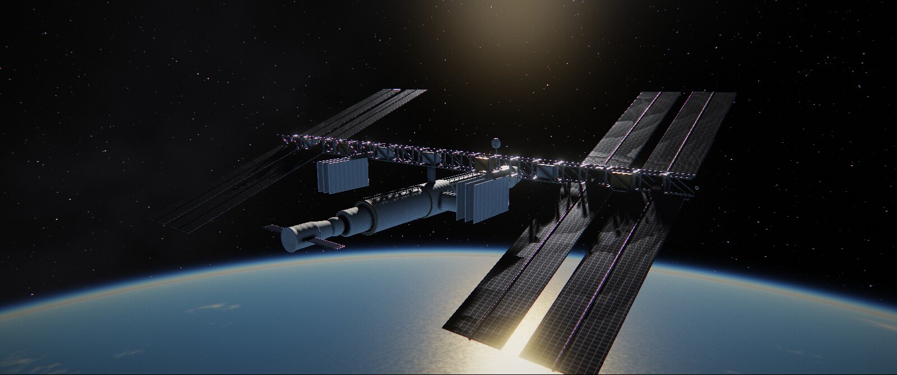
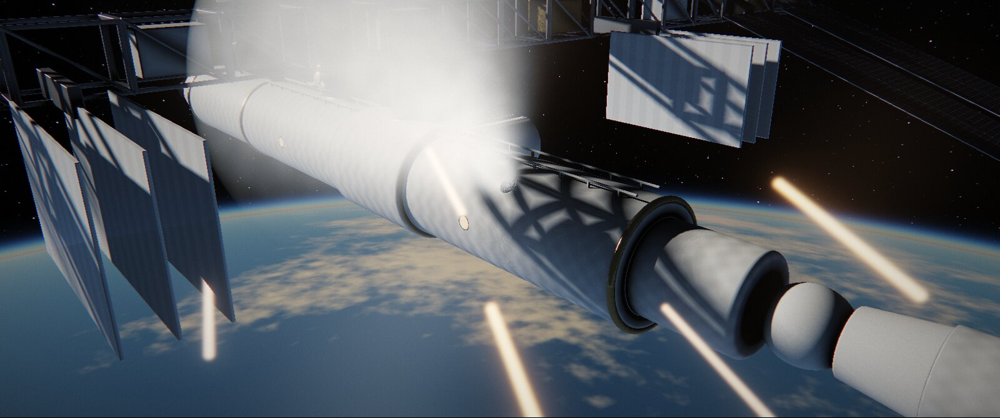
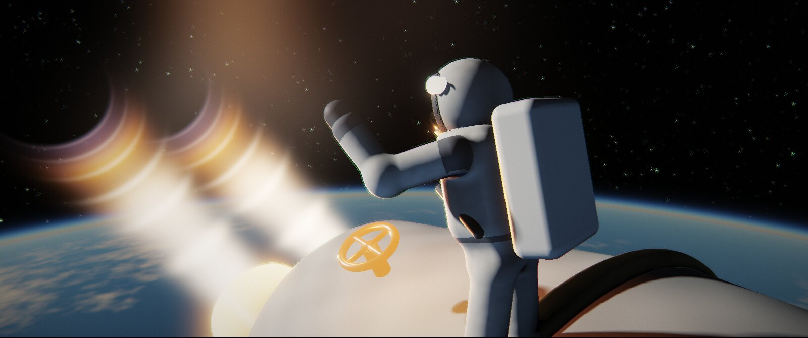
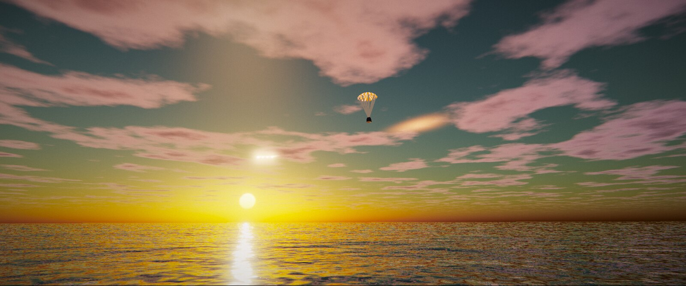
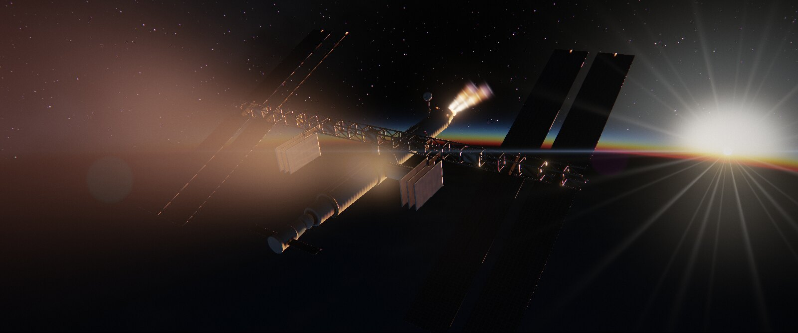
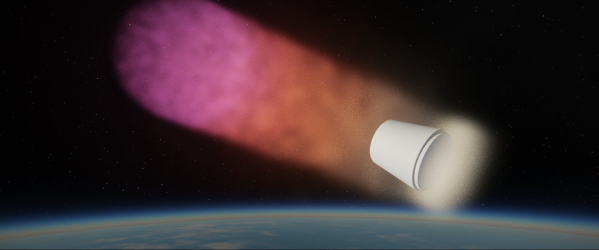
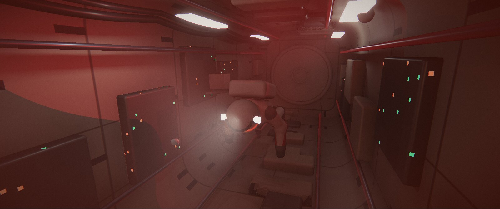

# ЗАРЯ — интерактивное кино (демо)



**Жанр:** интерактивное кино в духе Detroit / Until Dawn · **Длительность:** около 5 минут · **Концовки:** 4
**Язык:** C++17 · **Графика:** собственный HDR-рендер на raymarching (raylib + GLSL 3.3) · **Озвучка:** полная, на русском

> Низкая околоземная орбита, 408 км. Командир Алексей Громов заканчивает выход в открытый космос,
> когда Земля передаёт тревогу: разрушен спутник, облако обломков идёт прямо на станцию «Заря».
> Девяносто секунд — и дальше всё решают ваши выборы.

## Как запустить

**Windows (готовая сборка):**
1. Скачайте `release/ZARYA-windows-x64.zip` из этого репозитория.
2. Распакуйте архив куда угодно.
3. Запустите `zarya.exe`. Лучше всего играть в наушниках, в полноэкранном режиме (F11).

**Linux / macOS** — соберите из исходников (см. ниже). Кроме того, GitHub Actions
(`.github/workflows/build.yml`) собирает архивы под Windows, Linux и macOS
на каждый push: они лежат во вкладке *Actions*, в разделе *Artifacts* каждого запуска.

Нужна видеокарта с OpenGL 3.3. Рендер сам подстраивает внутреннее разрешение под
частоту кадров, а верхнюю планку качества можно поменять клавишей **F2** (или в главном меню).

## Управление

| Действие | Клавиши |
|---|---|
| Выбор в диалоге | **A** / **D**, **←** / **→**, **1** / **2** или мышь |
| Быстрые действия (QTE) | клавиша на экране: **ПРОБЕЛ**, **E**, **W**, **A/D** |
| Пауза | **Esc** или **P** |
| Полный экран | **F11** или **Alt+Enter** |
| Качество графики | **F2** |
| Отладочная информация | **F3** |

Геймпад тоже работает: **A** = пробел, **X** = E, **Y** = W, крестовина = влево/вправо.

## Что внутри

- **Сюжет из 4 частей:** «Рассвет», «Шторм», «Люк», «Падение», плюс холодное открытие (флешфорвард).
- **3 больших решения на таймере** (время замедляется, пока вы думаете) и **14 QTE** на всех ветках:
  нажать вовремя, долбить клавишу, удерживать, уклониться влево или вправо.
- **Последствия копятся:** закреплённая антенна даёт связь с Землёй в финале; провалы QTE ранят
  командира, и тогда для хорошей концовки нужно пройти все испытания; открытый или закрытый люк
  решает судьбу Марины.
- **4 концовки:** «Рассвет вдвоём», «Одинокий рассвет», «Падающая звезда», «Последний сигнал».
  Открытые концовки сохраняются между запусками.
- **79 озвученных реплик**, 4 персонажа с разной обработкой голоса: шлемофон, радио скафандра,
  дальняя связь с ЦУП (quindar-тоны, помехи), металлический голос бортового ИИ «ОРИОН».
- **Режиссура:** 77 планов, кинематографичный кадр 2.39:1 с субтитрами в чёрных полосах, операторская
  «ручная» камера, тряска от ударов, рапид во время выборов, dutch angle, крупные планы
  с отражениями в забрале, планы от первого лица с HUD скафандра и трещинами на стекле.

## Графика

Вся картинка считается в пиксельных шейдерах. Готовых моделей и текстур нет — только математика:

- **Земля:** рассеяние в атмосфере (Рэлей + Ми, одиночное рассеяние), процедурные материки,
  облака с тенями, солнечный блик на океане, огни городов, молнии и лунный свет на ночной стороне,
  восход из-за лимба.
- **Станция:** модули с термоэкранной «стёганкой», ферма, солнечные батареи с ячейками,
  радиаторы, антенна, корабль «Стриж», шлюзы с люками; мягкие тени, AO, GGX-отражения.
- **Скафандры:** SDF-фигуры с позами и анимацией, золотое забрало, в котором отражаются Земля и станция.
- **Эффекты:** трассеры обломков, искры, выброс воздуха из пробоины, факел двигателя с «ударными
  ромбами», плазма при входе в атмосферу, горящая станция в небе, парашют над океаном на рассвете.
- **Постобработка:** HDR, bloom (13-tap down / tent up), боке-глубина резкости, анаморфный
  блик с проверкой перекрытия солнца, ACES, сплит-тонирование, хроматическая аберрация, виньетка, плёночное зерно.
- **Динамическое разрешение:** рендер снижает или поднимает внутреннее разрешение, чтобы держать FPS.

<p>
 
 
 
</p>

## Сборка из исходников

Нужны CMake 3.16+, компилятор с C++17 и git: raylib 5.5 скачивается автоматически через FetchContent.

```bash
cmake -S . -B build -DCMAKE_BUILD_TYPE=Release
cmake --build build --config Release
./build/zarya            # Windows: build\Release\zarya.exe
```

- **Windows:** Visual Studio 2022 (компонент «Разработка классических приложений на C++») или MinGW.
- **Linux:** `sudo apt install build-essential cmake git libx11-dev libxrandr-dev libxinerama-dev libxcursor-dev libxi-dev libgl1-mesa-dev libasound2-dev`
- **macOS:** Xcode Command Line Tools + CMake.
- **Кросс-сборка под Windows из Linux:** `cmake -S . -B build-win -DCMAKE_TOOLCHAIN_FILE=cmake/mingw-w64.cmake`

После сборки рядом с исполняемым файлом копируются папки `assets/` и `shaders/`.

### Параметры командной строки (для разработки)

```
--fullscreen                  запуск на весь экран
--size 1920x1080              размер окна
--mute                        без звука
--autoplay SEED               автопрохождение со случайными решениями
--fixed-dt 0.02 --no-render   прогон логики без рендера; печатает путь и концовку
--capture DIR --every 2       сохранять кадр каждые 2 секунды
--shot seq:t,seq:t --flags marina,antenna,crack,hurt --capture DIR   отдельные кадры
--check                       проверка таймлайна: реплики не перекрываются и не обрываются
```

## Устройство кода

```
src/
  main.cpp        состояния игры (заставка, меню, фильм, пауза, финал), ввод, CLI-инструменты
  director.*      режиссёр: граф сцен, таймлайн событий, выборы, QTE, рапид, тряска
  script.cpp      сценарий: все сцены, планы и камеры, реплики, ветвления
  renderer.*      HDR-цели, bloom, композит, динамическое разрешение, позы скафандров
  audio.*         озвучка, музыка с кроссфейдами, эмбиент, приглушение под диалоги
  ui.*            субтитры, выборы, QTE, HUD шлема, титры, меню, экран концовки
shaders/
  space.frag      орбита: Земля, атмосфера, станция, корабль, обломки, плазма
  interior.frag   модуль станции: аварийный свет, дым, туман в «Бете», люки
  ground.frag     рассвет над океаном: небо, облака, волны, парашют, «падающая звезда»
  composite.frag  DOF, bloom, блик, трещины забрала, ACES, грейдинг, зерно
assets/
  dialogue.tsv    все реплики: персонаж, обработка, темп, текст
  voice/ music/ sfx/ fonts/
tools/
  gen_voice.py    озвучка: Piper TTS + цепочки эффектов (радио, шлем, ИИ)
  gen_audio.py    процедурная музыка и звуки: синтез, фильтры, свёрточный ревербератор
```

Чтобы поменять текст реплики, отредактируйте `assets/dialogue.tsv` и перегенерируйте озвучку:

```bash
pip install piper-tts numpy scipy soundfile
python tools/gen_voice.py --models <папка с ru_RU-*-medium.onnx> --only i01 i02
```

Модели голосов: https://huggingface.co/rhasspy/piper-voices/tree/main/ru/ru_RU

## Авторы и лицензии

- Код, сценарий, шейдеры, музыка и звуковые эффекты созданы для этого проекта.
  Музыку и эффекты синтезирует `tools/gen_audio.py`, сторонних сэмплов нет.
- Озвучка синтезирована [Piper TTS](https://github.com/rhasspy/piper) голосами ru_RU
  `dmitri` (Громов), `irina` (Марина), `ruslan` (ЦУП) и `denis` (ОРИОН). У моделей свои лицензии
  датасетов: для `ruslan` это CC BY-NC-SA 4.0, для `irina` лицензия не указана. Поэтому озвучка
  годится для некоммерческого демо; для коммерческого релиза её нужно заменить на живых актёров.
- Шрифты Montserrat и IBM Plex Mono распространяются по SIL Open Font License 1.1 (`assets/fonts/OFL.txt`).
- Движок: [raylib](https://www.raylib.com) (zlib).
- Все персонажи и события вымышлены.
